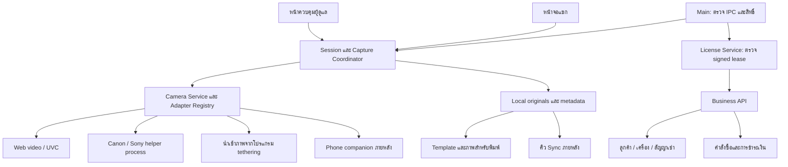

# KOKO Photobooth — แผนผลิตภัณฑ์และรากฐานระบบ

วันที่: 30 กันยายน 2026  
สถานะ: แผนต่อยอดจาก M1 และ M2.1; รอบนี้เป็นการวางแผน ยังไม่ได้เพิ่มฟังก์ชันใหม่ในแอป

## เป้าหมาย

สร้าง Photobooth สำหรับงานอีเวนต์ที่ใช้กล้องถ่ายรูป Canon/Sony ได้ตามรุ่นและความสามารถที่ทดสอบจริง บันทึกภาพในเครื่องอย่างปลอดภัย ใช้งานต่อได้เมื่ออินเทอร์เน็ตขัดข้อง และจำหน่ายสิทธิ์ใช้งานแบบเช่าได้ พร้อมรองรับการเพิ่มโทรศัพท์ แบรนด์กล้อง ระบบพิมพ์ และบริการออนไลน์ภายหลัง

อัปเดตล่าสุด: ผู้ใช้ยังไม่มีกล้องถ่ายรูปจริง จึงให้เริ่มเว็บแคม/กล้องคอมพิวเตอร์เพื่อใช้ Photobooth ได้จริงก่อน แล้วเพิ่ม Canon/Sony ภายหลัง รายละเอียดการใช้โทรศัพท์และรูปแบบคิดค่าเช่ายังต้องกำหนด ดู [แผน Webcam Photobooth](WEBCAM_PHOTOBOOTH_WORK_PLAN.md) เป็นลำดับปฏิบัติงานรอบถัดไป

## จุดตั้งต้นที่มีจริง

- Workspace: `D:\pKOKO`; ไม่มี `.git` จึงยังไม่มีประวัติการเปลี่ยนแปลงหรือจุดย้อนกลับแบบ Git
- M1: ผู้ใช้ยืนยันการทดสอบบน Windows จริง 9 รายการแล้ว
- M2.1: มี Electron/React shell, Settings ไทย/อังกฤษ, High Contrast, Fullscreen, Web MediaDevices adapter และ Camera Manager สำหรับรายการอุปกรณ์กับ preview
- M2.1: typecheck และ package ผ่านในรอบก่อน แต่ยังไม่ยืนยัน runtime กรณีไม่มีกล้องหรือ preview บนอุปกรณ์จริง
- M2.2 มี backend บันทึก JPEG และเลือกโฟลเดอร์แล้ว; ยังไม่มี capture UI หรือ guest capture flow ไม่มีระบบเช่า เซิร์ฟเวอร์สิทธิ์ หรือ adapter SDK
- ยังไม่ทราบรุ่นกล้อง และการตรวจพบ video input ไม่ยืนยัน remote shutter หรือคุณภาพภาพนิ่งจากกล้อง

## สถาปัตยกรรมที่เสนอ

เริ่มจากแอป Desktop เดิมและเซิร์ฟเวอร์ธุรกิจหนึ่งระบบที่แบ่งโมดูลชัดเจน ยังไม่จำเป็นต้องแยกเป็น microservices หลายระบบ

ภาพนี้แสดงโมดูลเป้าหมาย ไม่ใช่รายการที่ติดตั้งแล้วในแอป

### ขอบเขตความรับผิดชอบ

| ส่วน | หน้าที่ | หลักการแยกส่วน |
| --- | --- | --- |
| Shared domain | Camera capabilities, Event, Session, Photo, License lease และ error codes | ไม่มี DOM, Electron หรือ SDK dependency |
| Renderer | Preview, countdown, review, Settings และแสดงปัญหา | เรียกคำสั่งที่กำหนดไว้ผ่าน Preload |
| Main / application services | ตรวจข้อมูลและสิทธิ์ ประสาน capture เก็บไฟล์และ metadata | เป็นเจ้าของสถานะงานและ durable save |
| Camera adapter | เชื่อมต่อกับอุปกรณ์ตามความสามารถจริง | ไม่รู้เรื่องราคา template หรือ cloud album |
| Vendor helper | โหลด SDK และจัดการ native resources | แยก process เพื่อจำกัดผลกระทบเมื่อ SDK ค้างหรือ crash |
| Local storage | ภาพต้นฉบับ checksum metadata migration และ recovery | ทำงานได้โดยไม่มีเซิร์ฟเวอร์ |
| License Service | ตรวจ signed lease และตัดสินสิทธิ์เริ่มงาน | ไม่ลบภาพและไม่เป็นผู้เก็บภาพ |
| Business API | บัญชีลูกค้า สิทธิ์เช่า เครื่องที่เปิดใช้ และการชำระเงิน | แยกข้อมูลธุรกิจจาก gallery/photo storage |

Camera interface เดิมที่คืน `MediaStream` และรับ `HTMLVideoElement` จะคงไว้สำหรับ Web adapter ระหว่างเปลี่ยนผ่าน แต่สัญญากล้องระดับระบบในอนาคตต้องรองรับ preview หลายชนิด และไฟล์ภาพจาก SDK โดยไม่บังคับให้ native adapter ใช้ DOM

## ลำดับพัฒนาและเกณฑ์ส่งมอบ

ใช้หมายเลข M เดิมสำหรับเส้นทาง Photobooth และ C สำหรับระบบเช่า เพื่อลดความสับสนกับเอกสารก่อนหน้า

| ระยะ | สิ่งที่พัฒนา | เงื่อนไขเริ่ม | ถือว่าผ่านเมื่อ |
| --- | --- | --- | --- |
| เตรียมงาน | สำรอง baseline, ตั้ง Git เมื่อพร้อม, ระบุ Windows/PC/กล้องและที่เก็บภาพ | ใช้ workspace ปัจจุบัน | มีจุดย้อนกลับและรายการอุปกรณ์ที่จะทดสอบ |
| M2.1 verification | ตรวจรายการกล้อง permission preview การถอด/เปลี่ยนอุปกรณ์และออกจากหน้า | มีกล้อง/เครื่องจริง | ผล hardware แยกจาก build และสถานะสอดคล้องกับอุปกรณ์ |
| Camera feasibility ภายหลัง | ตรวจ Canon/Sony รุ่นเป้าหมาย USB ก่อน แล้วประเมิน Wi-Fi | มีกล้องจริง ทราบรุ่น firmware และเงื่อนไข SDK | รู้เส้นทาง preview/capture พร้อม fallback ของแต่ละรุ่น |
| M2.2 local save foundation | ตั้ง storage root, capture result contract, safe file write, metadata และ recovery | ขั้นตอนและตำแหน่งจัดเก็บชัดเจน | ตัดไฟ/restart แล้วภาพที่บันทึกสำเร็จกลับมาได้; disk-full ไม่ทำลายภาพเก่า |
| M2.2A Webcam Capture | เพิ่ม frame capture จากเว็บแคมและเชื่อม safe save | เว็บแคมจริงและ storage พร้อม | JPEG จริงบันทึกได้และแสดงผลหลัง Main ยืนยัน |
| M2.3 guest capture | Countdown, capture, review, retake, จำนวนภาพ และ recent photos | มี source ที่ถ่ายภาพจริงและ safe save ผ่าน | แขกจบ flow ได้ออฟไลน์ ไม่มีภาพสำเร็จปลอมและไม่มี capture ซ้อน |
| M2.4 photo review/recovery | ดูภาพหลัง restart และตรวจ/import/quarantine ไฟล์ค้าง | Capture/save ผ่าน | ภาพเดิมเปิดดูได้และผล recovery ตรวจสอบได้ |
| M3 events | Event/session ownership และกู้คืนงาน | M2.2–2.3 | เปลี่ยนงานแล้วภาพไม่ปะปนและกู้ session ได้ |
| M4 templates | Layout/version, original-preserving composition และ export | M3 | ขนาด/ตำแหน่งถูกต้อง ต้นฉบับไม่ถูกเขียนทับ |
| M5 camera expansion | เพิ่มรุ่น/แบรนด์/transport และปรับ fallback ตามผล feasibility | กล้องแรกผ่านและ SDK/อุปกรณ์เพิ่มเติมพร้อม | รุ่นที่ระบุผ่านความสามารถที่ประกาศจริง; SDK crash ไม่ทำให้ UI ค้าง |
| C1 rental domain | รูปแบบเช่า feature catalog device seats signed lease และ policy ออฟไลน์ | กำหนดนโยบายธุรกิจ | กรณีหมดอายุ/เวลาเครื่องผิด/ย้ายเครื่องมีผลลัพธ์ชัดเจน |
| C2 activation service | Backend + Desktop activation/renewal/deactivation/admin | C1 และ infrastructure พร้อม | ตรวจลายเซ็นจริง จำนวนเครื่องถูกบังคับที่ server และใช้ออฟไลน์ตาม lease |
| C3 billing | Checkout หรืออนุมัติชำระเงิน, webhook, ต่ออายุ และ reconciliation | เลือกช่องทางชำระเงินและราคา | callback ซ้ำไม่เพิ่มสิทธิ์ซ้ำ หน้าจอจ่ายเงินไม่ใช่หลักฐานสิทธิ์ |
| M6–M7 delivery | Durable sync, private gallery และ QR ตามการอนุญาต | Local product เสถียรและ API พร้อม | ภาพคงอยู่ในเครื่อง ส่งซ้ำไม่ซ้ำ และแชร์เฉพาะ audience ที่เลือก |
| M8 printing | Printer adapter และคิวงานพิมพ์ | Templates และเครื่องพิมพ์จริง | เครื่องพิมพ์ขัดข้องไม่หยุดการถ่ายภาพ |
| Phone extension | เลือก phone-as-camera หรือ standalone web flow | ตัดสินรูปแบบโทรศัพท์และระบบจับคู่ | Android/iOS รุ่นที่ระบุผ่าน disconnect/reconnect และ ownership tests |
| Commercial release | Signed installer, migration/rollback, diagnostics และ rehearsal | Local flow + C2/C3 ผ่าน | ผ่านงานจำลองด้วยชุดอุปกรณ์จริงและมีแผนช่วยเหลือลูกค้า |

เริ่ม guest flow ด้วยเว็บแคมได้ทันทีโดยใช้ video-frame capture และ storage เดิม ทำ Camera feasibility ก่อนเพิ่ม SDK ภายหลัง ไม่ผูก Coordinator/Review/Storage เข้ากับกล้องยี่ห้อแรก

หากกล้องแรกใช้ folder import ต้องระบุว่าใครสั่ง shutter และไม่เปิดปุ่ม countdown-to-shutter ใน KOKO จนมี control adapter ที่ทำได้จริง จึงไม่ถือว่า folder import อย่างเดียวผ่าน guest flow แบบสั่งกล้องอัตโนมัติ

## หลักการเก็บภาพ

1. ผู้ดูแลเลือกและยืนยัน storage root; ตรวจสิทธิ์เขียนและพื้นที่สำรองก่อนเริ่มงาน
2. จอง photo ID และผูก event/session ก่อนส่งคำสั่ง shutter
3. รับไฟล์จริงจาก adapter เขียน temporary file ใน volume เดียวกัน ตรวจ decode/ขนาด/type และ checksum แล้ว flush/rename
4. บันทึก metadata แบบ transaction หลังภาพต้นฉบับมีอยู่จริง; สถานะ saved แสดงเมื่อขั้นตอนนี้สำเร็จ
5. ทำ thumbnail, template, printing และ upload เป็นงานถัดไปที่ retry ได้
6. ตรวจ orphan/missing file หลัง restart และเสนอ recovery โดยเก็บหลักฐานเดิม

SQLite และ filesystem เป็นเป้าหมาย แต่เลือก driver หลังตรวจ Electron/runtime ที่ใช้จริง ไม่เพิ่ม dependency เพียงเพื่อวางชื่อโมดูล

## การขยายที่เตรียมไว้

- Adapter registry เลือกตามความสามารถและผลตรวจรุ่น แทนการเขียนเงื่อนไขแบรนด์ในหน้า UI
- Schema/version ของ template, metadata, camera protocol และ lease มี migration path
- Template, printer และ sync ทำงานผ่าน queue ที่มี idempotency และสถานะ recoverable
- Feature catalog แยกจากราคา เพื่อขายแพ็กเกจใหม่ได้โดยไม่เปลี่ยนความหมายข้อมูลเก่า
- License backend เริ่มแบบ modular monolith; เพิ่ม tenant isolation และ role checks ตั้งแต่ schema/API รุ่นแรก
- Telemetry/diagnostics ส่งเฉพาะเมื่อผู้ใช้เลือก; ไม่รวมภาพหรือ credential โดยอัตโนมัติ

## แผนทดสอบ

Automated: camera state transitions และ stale operation; timeout/retry; partial file; duplicate download; power-loss recovery; event ownership; template output; signed lease tampering/expiry/device binding; concurrent seat activation และ payment webhook replay

Hardware: กล้องแต่ละรุ่น firmware ที่ระบุ USB/Wi-Fi แยกกัน, ถอดสาย/ปิดกล้อง/sleep/busy, สภาพแสง/flash, resolution และเวลา capture-to-save; ต่อด้วย printer และโทรศัพท์เฉพาะรุ่นที่มีใน matrix

ก่อนเปิดเช่า: จำลองงานเต็มด้วย PC/กล้อง/สาย/storage เดียวกับที่ใช้จริง ทดสอบ internet loss, restart, disk-full, lease ใกล้หมดอายุ และสำรองภาพ โดยบันทึกความเสี่ยงที่ยังเหลือ

## สิ่งที่ต้องระบุเพื่อเริ่ม implementation ถัดไป

1. Canon/Sony รุ่นแรกและ firmware; ต้องการ USB, Wi-Fi หรือทั้งคู่ในรุ่นเดียวกัน
2. Windows version, CPU architecture, PC และกล้องที่จะใช้ทดสอบ
3. Storage root ที่ผู้ดูแลเลือกได้หรือค่าเริ่มต้น พร้อมนโยบายสำรองและการเก็บภาพ
4. เช่าตามระยะเวลา/งาน/สมาชิก และจำนวนเครื่องที่เปิดพร้อมกัน
5. ระยะออฟไลน์ที่ต้องการและวิธีรับชำระเงิน

ยังไม่กำหนดราคา วันส่งมอบ หรือประกาศรองรับรุ่นใดโดยไม่มีข้อมูลและผลทดสอบ

## เอกสารรายละเอียด

- [แผนกล้องและ compatibility](CAMERA_COMPATIBILITY_PLAN.md)
- [แผนระบบเช่าและ licensing](RENTAL_LICENSING_PLAN.md)
- [ผล M2.1 ที่มีอยู่](MILESTONE_2_CAMERA_MVP.md)
- [Roadmap เดิม](IMPLEMENTATION_PLAN.md) เป็นข้อมูลอ้างอิงก่อนขยายขอบเขตนี้

M2.2 เริ่มพัฒนาต่อในเอกสาร [รายงาน M2.2](MILESTONE_2_2_LOCAL_STORAGE.md); adapter shutter, guest capture, event/session และระบบเช่ายังเป็นงานใน roadmap
