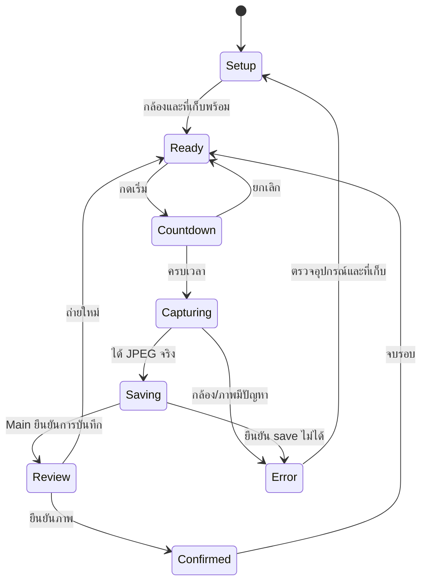

# แผนทำ Photobooth ใช้งานจริงด้วยกล้องคอมพิวเตอร์

สถานะ: เริ่มใช้งาน webcam capture และ guest entry แล้ว; ยังต้องทดสอบการทำงานบนอุปกรณ์จริงก่อนรับรอง

อัปเดต 3 ตุลาคม 2026: Browser adapter ระบุความสามารถ `video-input` และ `video-frame` เพื่อให้เพิ่ม phone-network, camera SDK หรือ folder adapter ภายหลังได้โดยใช้ flow บันทึกภาพเดิม โหมดแขกเปิด Capture Studio แบบเต็มจอและใช้ capture/storage flow เดียวกัน โดยต้องมี License และโฟลเดอร์จัดเก็บก่อนเริ่ม การทดสอบ webcam จริงยังค้างอยู่ตามที่วางแผนไว้

อัปเดตงานต่อ: Guest mode ซ่อนแผงผู้ดูแลและแสดงภาพที่ถ่ายในรอบปัจจุบัน พร้อมตัวเลือกถ่ายเพิ่มหรือยืนยันจบรอบ เลือกเทมเพลตที่บันทึกไว้ให้กำหนดจำนวนภาพและสร้างภาพประกอบเพื่อดาวน์โหลดได้ Main บันทึก template snapshot, Event และ photo IDs ลง `capture-sessions.json`; หน้า Capture Sessions แสดงภาพและสถานะรอบหลังเปิดแอปใหม่ ผลภาพประกอบยังเป็นไฟล์ดาวน์โหลดจากหน้า Guest ไม่ได้เก็บเป็นรายการในคลัง ส่วนผลทดสอบรอบนี้มี typecheck และ automated store/capture checks ผ่าน แต่ Windows UI/camera walkthrough ยังทำไม่ได้ใน session นี้

## เป้าหมายและจุดตั้งต้น

ผู้ใช้ยังไม่มีกล้องถ่ายรูปจริง จึงเริ่มด้วยกล้องคอมพิวเตอร์/USB webcam ให้ถ่าย บันทึก ดูผล และถ่ายใหม่ได้จริงแบบออฟไลน์ จากนั้นเพิ่ม Canon/Sony เมื่อมีอุปกรณ์ โดยไม่ต้องรอ SDK เพื่อพัฒนา flow หลัก

ปัจจุบันมี preview, capture button, countdown, review, recent photos และระบบบันทึก JPEG ใน Main แล้ว โค้ดบันทึกขนาดภาพและผูกภาพกับ Event ที่กำลังใช้งานได้ แต่สถานะยืนยัน/ถ่ายใหม่ของแต่ละรอบยังไม่บันทึกถาวร และยังไม่มีผลทดสอบ webcam จริงในรอบนี้

## ลำดับงาน

| ระยะ | งาน | ผลส่งมอบ |
| --- | --- | --- |
| M2.2A Webcam Capture | เพิ่ม capability และ frame capture ใน Browser adapter เชื่อม savePhoto และปุ่มถ่ายใน Operator | JPEG จริงจากเว็บแคมถูกบันทึก มีหลักฐาน metadata และแสดงผลหลังบันทึกสำเร็จ |
| M2.3 Guest Flow | แยก capture coordinator/state machine จาก React เพิ่ม countdown, review, retake และ confirm | แขกจบหนึ่งรอบโดยไม่ต้องให้ผู้ดูแลสั่งทุกขั้น |
| M2.4 Photo Review/Recovery | ดูภาพล่าสุด เปิดดูผลหลัง restart และหน้าตรวจไฟล์ orphan/temp/missing | ภาพที่เคยบันทึกกลับมาเห็นได้ และปัญหาแต่ละรายการมีทางแก้ |
| M3 Event/Session | เก็บ ownership และสถานะการยืนยัน/retake แบบ durable พร้อม migration | ภาพแยกตามงาน ไม่หายหลัง restart และไม่ปะปนเมื่อเปลี่ยนงาน |
| M4 Template | เลือก layout/จำนวนภาพ ประกอบภาพและ export โดยรักษาต้นฉบับ | ผลลัพธ์พร้อมใช้ในงานจริงตาม template ที่ทดสอบ |
| Real-event rehearsal | ทดสอบต่อเนื่อง restart, กล้อง busy/ถอด, storage outage และหน้าจอสัมผัส | หลักฐานความพร้อมของชุด PC/เว็บแคมจริง ก่อนนำไปรับงาน |
| Camera expansion / rental | เพิ่ม Canon/Sony adapter และระบบสิทธิ์เช่าตามเอกสารแยก | ใช้ capture/storage/guest flow เดิม และกำหนด compatibility ต่อรุ่น |

## งานรอบแรก: M2.2A

1. ตรวจ code/status และสำรองจุดเริ่มต้น เนื่องจาก workspace ยังไม่มี Git
2. ให้ adapter รายงาน preview และ capture mode อย่างชัดเจน: เว็บแคมคือ video-frame ไม่ใช่ remote shutter
3. แก้สถานะ adapter ที่ปัจจุบัน getStatus คืน searching เสมอ และให้ manager เป็นเจ้าของ lifecycle/operation token
4. เริ่ม capture เมื่อมี live track และ video frame พร้อมจริงเท่านั้น ใช้ขนาด videoWidth/videoHeight ที่ได้จริง ไม่ขยายภาพเพื่ออ้างความละเอียดเพิ่ม
5. แปลงเฟรมเป็น JPEG และส่งผ่าน savePhoto ที่มีอยู่; ป้องกันกดซ้ำ/เลือกกล้องระหว่าง operation และจัดการผลลัพธ์ที่กลับมาหลังออกจากหน้า
6. ก่อน capture ต้องมี storage configured และไม่มีปัญหาที่ทำให้ยืนยัน save ไม่ได้ เพิ่ม free-space check ที่ Main พร้อมจัดการ ENOSPC ระหว่างเขียน แม้ preflight ผ่าน
7. แสดงภาพ review ด้วย object URL ที่มีอายุเฉพาะหน้านั้น แล้ว revoke เมื่อเปลี่ยนภาพ/ออกจากหน้า; ไม่เปิด filesystem ทั้งหมดให้ Renderer
8. ข้อความ saved แสดงหลัง Main ส่ง metadata ยืนยันเท่านั้น ถ้า save ล้มเหลวให้คงภาพใน memory เพื่อ retry เมื่อทำได้ และแสดง pending recovery หากสถานะบันทึกไม่แน่นอน

ไฟล์เป้าหมาย: renderer/camera adapter และ manager, capture coordinator, CameraPanel/preview, shared capture result, Main storage status/save validation และ tests ที่เกี่ยวข้อง ไม่เพิ่ม dependency จนมีเหตุผลจำเป็น

## Guest flow ที่จะทำใน M2.3

เริ่มต้นหนึ่งภาพต่อรอบและ countdown 3 วินาทีเป็นค่าเสนอ ปรับได้ในระยะต่อไป Capture Coordinator ใช้ state transitions ตรวจคำสั่งซ้ำ ไม่ผูกธุรกิจไว้ในปุ่ม React

Retake เก็บไฟล์ที่บันทึกแล้วไว้และไม่ลบต้นฉบับอัตโนมัติ; ก่อนใช้หลายภาพ/template ต้องบันทึกสถานะ accepted/retaken และ session ownership แบบ durable ใน M3 ส่วนการยืนยันใน prototype รอบแรกต้องระบุว่ายังไม่ใช่ event record ถาวร

ถ้ากล้องถูกถอดตอน countdown ให้ยกเลิกตัวจับเวลา ถ้าออกจากหน้าให้หยุด preview/cancel pending UI work แต่ไม่ยกเลิกหรือทำลาย file commit ที่เริ่มแล้ว Main ยังจบงานหรือรายงาน recovery ได้

## การดูภาพหลัง restart และกู้คืน

- เพิ่ม list/read commands ที่รับ photo ID และตรวจจาก manifest เท่านั้น Main เป็นผู้ resolve path
- จำกัดขนาดภาพ/จำนวนรายการและใช้ thumbnail เมื่อมีภาพมาก ไม่ส่งภาพทั้งหมดผ่าน IPC ทุกครั้ง
- orphan: ตรวจ decode/hash และให้ผู้ดูแลเลือก import โดยกำหนด provenance; ไม่เดาว่าเป็นภาพของ event ใด
- temp: ถือว่าอาจไม่สมบูรณ์ ให้ตรวจและ quarantine/ลบอย่างชัดเจน ไม่แสดงเป็น saved
- missing/hash mismatch/manifest เสีย: คงหลักฐานและแจ้ง needs attention ก่อนแก้ ไม่สร้างความสำเร็จจำลอง
- แยก photo repository ออกจาก UI; ประเมิน SQLite และ migration ก่อน event ownership/งานขนาดใหญ่

## รากฐานสำหรับกล้องถ่ายรูป

สัญญา capture ระดับระบบต้องคืน capture ID, source ID/mode, dimensions/MIME และข้อมูลภาพหรือ handle แบบจำกัด ใช้ video-frame สำหรับเว็บแคม และ camera-original สำหรับ SDK ที่ผ่านการทดสอบในอนาคต

Capability เป็นตัวตัดสินว่าทำ preview/shutter/download ได้หรือไม่ ชื่อยี่ห้อหรือการตรวจพบ video input ไม่เพิ่มสิทธิ์ shutter เอง Adapter ใหม่ใช้ Coordinator/Review/Storage เดิม ส่วน preview transport และ native SDK lifecycle แยกตาม source

## การตรวจรับ

Automated: countdown cancel, double-click, stale operation หลัง unmount/เปลี่ยนกล้อง, encode failure, save failure/uncertain completion, retry ไม่บันทึกซ้ำโดยไม่ตั้งใจ, malformed JPEG และ storage recovery พร้อม typecheck/package ตาม scripts

Windows จริง: webcam permission, no camera, busy camera, เปลี่ยน/ถอดอุปกรณ์, preview/frame dimensions, เลือกโฟลเดอร์/ยกเลิก, บันทึกและเปิด JPEG จริง, restart, พื้นที่เต็ม/drive หาย, fullscreen/Esc, ภาษาและ High Contrast

M2.2A ผ่านเมื่อ Operator ถ่าย JPEG จากเว็บแคมจริง บันทึกในโฟลเดอร์ที่เลือก ตรวจขนาด/checksum ได้ และข้อผิดพลาดไม่แสดง saved ปลอม M2.3 ผ่านเมื่อแขกทำ countdown/review/retake/confirm ได้ต่อเนื่องออฟไลน์ โดยไม่ล็อก UI

## ขอบเขต

ยังเลื่อน SDK เฉพาะยี่ห้อจนมีรุ่นกล้องและอุปกรณ์ทดสอบ โทรศัพท์ licensing payment printing และ cloud แยกเป็นระยะต่อไป การทำ webcam MVP ไม่ถือว่ารองรับกล้องถ่ายรูปทุกยี่ห้อ

รอบนี้แก้เฉพาะเอกสารใน D:\pKOKO ไม่แก้ C:\KOKOwedding
